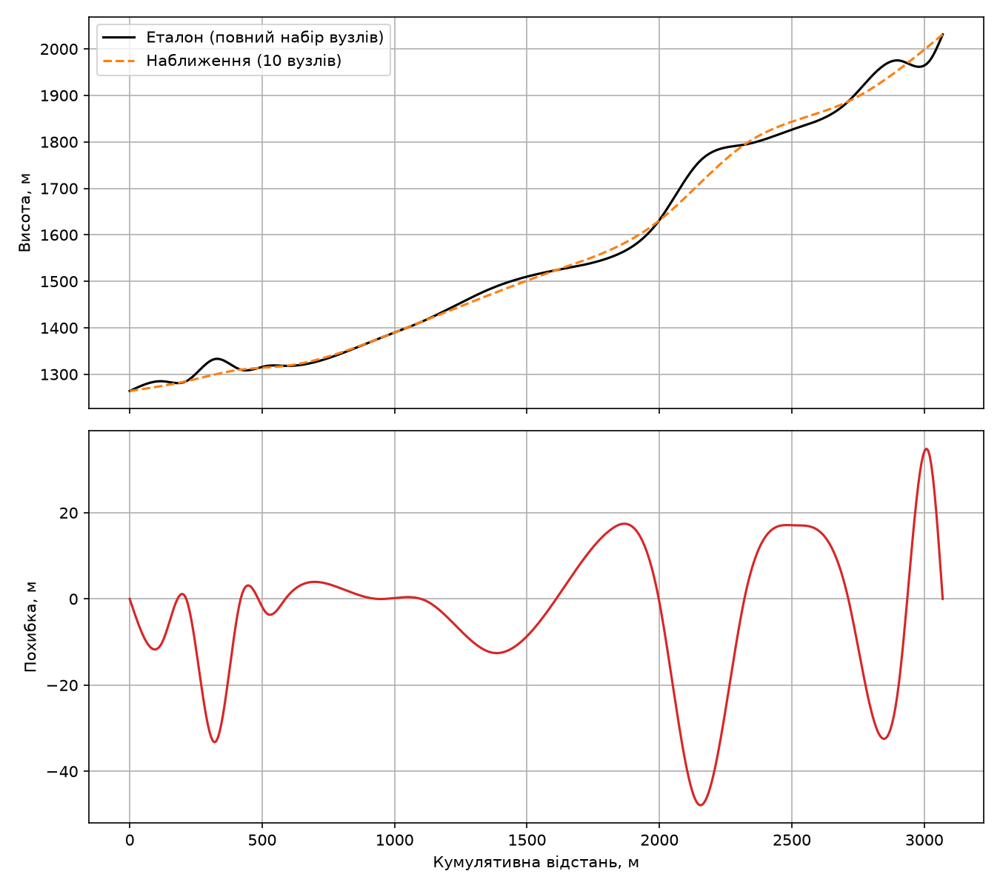
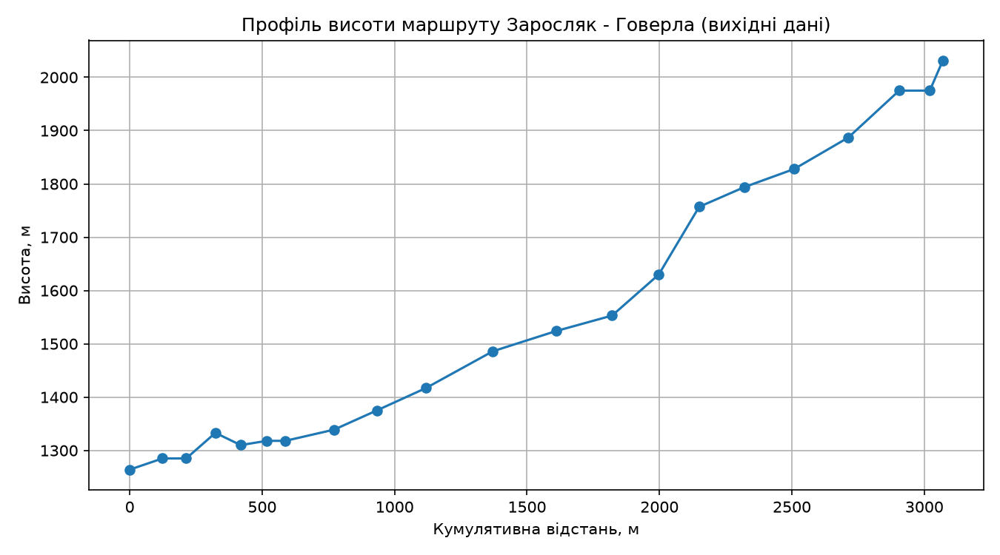
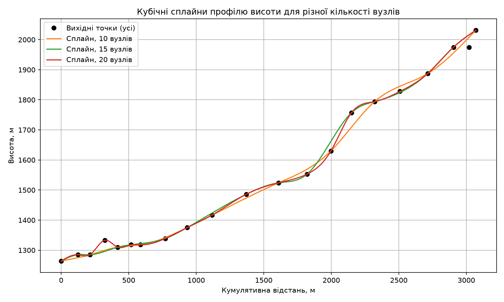

Звіт з лабораторної роботи №1
Інтерполяція кубічними сплайнами

Тема: Побудова гладкого профілю висоти маршруту за допомогою кубічних сплайнів Маршрут: станція Заросляк → вершина г. Говерла

1. Мета роботи

Вивчити метод інтерполяції кубічними сплайнами та застосувати чисельні методи до реальних геоданих (GPS-координат) для побудови гладкого профілю висоти туристичного маршруту й аналізу його складності.

2. Хід роботи
2.1. Отримання вихідних даних

Дані про висоту рельєфу отримано через відкритий API Open-Elevation.

Зауваження: в методичці адреса API вказана з помилкою — api.openelevation.com (без дефіса). Правильна, робоча адреса офіційного сервісу — https://api.open-elevation.com/api/v1/lookup (з дефісом між "open" та "elevation"). Без цього виправлення запит завершувався тайм-аутом з'єднання.

За 21 GPS-координатою вздовж маршруту отримано таблицю широти, довготи та висоти:

№	Latitude	Longitude	Elevation (м)
0	48.164214	24.536044	1264.00
1	48.164983	24.534836	1285.00
2	48.165605	24.534068	1285.00
3	48.166228	24.532915	1333.00
4	48.166777	24.531927	1310.00
5	48.167326	24.530884	1318.00
6	48.167011	24.530061	1318.00
7	48.166053	24.528039	1339.00
8	48.166655	24.526064	1375.00
9	48.166497	24.523574	1417.00
10	48.166128	24.520214	1486.00
11	48.165416	24.517170	1524.00
12	48.164546	24.514640	1553.00
13	48.163412	24.512980	1630.00
14	48.162331	24.511715	1757.00
15	48.162015	24.509462	1794.00
16	48.162147	24.506932	1828.00
17	48.161751	24.504244	1887.00
18	48.161197	24.501793	1975.00
19	48.160580	24.500537	1975.00
20	48.160250	24.500106	2031.00
2.2. Кумулятивна відстань

Відстань між сусідніми точками обчислено за формулою гаверсинуса. Загальна довжина маршруту склала 3069.34 м (≈ 3.07 км), що добре узгоджується зі значенням ~3.2 км, вказаним на скріншоті траси в методичці.

2.3. Побудова кубічного сплайна

Для побудови природного кубічного сплайна (крайові умови c₀ = cₙ = 0) розв'язано трьохдіагональну систему лінійних рівнянь методом прогонки (пряма прогонка — обчислення коефіцієнтів l, μ, z; зворотна прогонка — обчислення c, b, d).

Отримано коефіцієнти a, b, c, d для кожного з 20 інтервалів між 21 вузлом (фрагмент таблиці):

i	a	b	c	d
0	1264.0000	0.270269	0.00000000	−0.0000065656
1	1285.0000	−0.031855	−0.00243944	0.0000311944
...	...	...	...	...
19	1975.0000	0.750989	0.01231941	−0.0000843795

(повна таблиця — у виводі консолі програми)

2.4. Порівняння точності для різної кількості вузлів

Для оцінки впливу кількості вузлів на точність побудовано сплайни для підмножин з 10, 15 та 20 точок і порівняно їх з "еталонним" сплайном, побудованим на всіх 21 вузлі:

Кількість вузлів	Максимальна похибка (м)	Середня похибка (м)
10	47.877	11.668
15	45.168	7.179
20	45.306	2.355

Спостереження: середня похибка апроксимації монотонно зменшується зі збільшенням кількості вузлів (з 11.67 м до 2.36 м) — це очікуваний результат, оскільки більша кількість вузлів точніше описує форму реального рельєфу. Максимальна похибка залишається приблизно на одному рівні (45–48 м) для всіх трьох варіантів — вона локалізована на ділянці з найрізкішим перепадом висоти маршруту (там, де сплайн з малою кількістю вузлів "згладжує" різкий підйом), а не розподілена рівномірно по всій довжині траси.

2.5. Графіки
profile_raw.png — вихідні дані (кумулятивна відстань → висота).
profile_splines_10_15_20.png — порівняння трьох сплайнів (10, 15, 20 вузлів) на фоні вихідних точок.
profile_error.png — еталонна крива, наближення (10 вузлів) та графік похибки.

3. Характеристики маршруту
Показник	Значення
Загальна довжина маршруту	3069.34 м (≈ 3.07 км)
Сумарний набір висоти	790.0 м
Сумарний спуск	23.0 м
Максимальний підйом (градієнт)	134.7 %
Максимальний спуск (градієнт)	−35.4 %
Середній градієнт (модуль)	27.9 %
Механічна робота підйому (маса 80 кг)	619 992 Дж ≈ 620.0 кДж
Енергія підйому	≈ 148.2 ккал

Зауваження щодо максимального градієнта: значення 134.7% є локальним артефактом чисельного диференціювання сплайна на короткій ділянці з різкою зміною висоти, а не буквальним фізичним ухилом стежки — на практиці такий кут нахилу неможливий. Це варто враховувати при інтерпретації результату: похідна кубічного сплайна є більш чутливою до шуму у вхідних даних, ніж сама функція.

4. Висновки
Кубічні сплайни дозволяють побудувати гладку, двічі неперервно диференційовану апроксимацію профілю висоти за дискретним набором GPS-точок.
Метод прогонки ефективно розв'язує трьохдіагональну систему рівнянь за O(n) операцій, що робить його придатним для обробки навіть великих наборів геоданих.
Точність апроксимації зростає зі збільшенням кількості вузлів інтерполяції, проте вже 15–20 точок дають прийнятну для практичних задач точність (середня похибка кілька метрів).
Маршрут Заросляк–Говерла характеризується значним сумарним набором висоти (790 м) на дистанції ~3.07 км, що відповідає середньому ухилу близько 28% і підтверджує його складність для непідготовлених туристів.